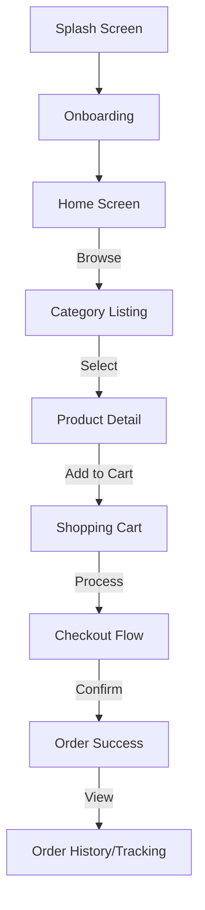

# 🐟 Seafood Store App — پروجیکٹ کی مکمل تفصیل / Complete Project Description

---

## 🇵🇰 اردو میں تعارف (Introduction in Urdu)

### پروجیکٹ کا نام
**Seafood Store App** — بحری خوراک کی آن لائن خریداری کی ایپلیکیشن

### مقصد
یہ ایک جدید **Flutter** ایپلیکیشن ہے جو بحری خوراک (Seafood) کی خرید و فروخت کے لیے ڈیزائن کی گئی ہے۔ اس ایپ کا مقصد صارفین کو گھر بیٹھے تازہ مچھلی، جھینگے، اور دیگر بحری اشیاء فراہم کرنا ہے۔ یہ ایپ نہ صرف خوبصورت ڈیزائن (UI) پر مبنی ہے بلکہ اس میں خریداری کا مکمل نظام (Ecommerce Flow) موجود ہے۔

### اہم خصوصیات (Key Features)
- 🌊 **پریمیم ڈیزائن**: سمندری تھیم پر مبنی خوبصورت اور دلکش انٹرفیس۔
- 👋 **آن بورڈنگ**: نئے صارفین کے لیے ایپ کے تعارف کی بہترین سکرینز۔
- 🔍 **مصنوعات کی تلاش**: مختلف زمرہ جات (Categories) جیسے مچھلی، جھینگے، کیکڑے وغیرہ میں تقسیم۔
- ⚖️ **وزن کا انتخاب**: اپنی ضرورت کے مطابق وزن منتخب کریں، قیمت خودکار طور پر تبدیل ہوگی۔
- 🛒 **کارٹ سسٹم**: اشیاء کو کارٹ میں شامل کرنے اور وہاں سے مینج کرنے کی مکمل سہولت۔
- 💳 **چیک آؤٹ**: تین مراحل پر مشتمل آسان چیک آؤٹ (بیٹھک، وقت کا انتخاب، اور ادائیگی)۔
- 🚚 **آرڈر ٹریکنگ**: آرڈر دینے کے بعد اس کی صورتحال جاننے کے لیے ٹائم لائن۔
- 📦 **ماک ڈیٹا**: فی الحال یہ ایپ ٹیسٹنگ ڈیٹا (Mock Data) استعمال کر رہی ہے جسے کسی بھی وقت اصلی API سے جوڑا جا سکتا ہے۔

### استعمال کے مواقع (Use Cases)
- **سی فوڈ ریٹیلرز**: وہ دکاندار جو اپنی مصنوعات آن لائن بیچنا چاہتے ہیں۔
- **ہول سیل سپلائرز**: ریسٹورنٹس اور ہوٹلوں کو تازہ سپلائی فراہم کرنے کے لیے۔
- **ہوم ڈیلیوری سروسز**: مقامی سطح پر تازہ مچھلی کی فراہمی کے لیے۔

---

## 🇬🇧 English Description

### Project Name
**Seafood Store App** — Premium Online Seafood Marketplace

### Purpose
The Seafood Store App is a **Flutter-based mobile frontend MVP** designed for a high-end seafood e-commerce experience. It combines a stunning "Ocean-Glassmorphism" aesthetic with functional e-commerce logic, enabling users to browse, select, and purchase fresh seafood with ease.

### Key Features

| Feature | Description |
|---|---|
| 🌊 Modern UI | Premium ocean-themed design with smooth animations and transitions. |
| 🚀 Dynamic Onboarding | High-conversion onboarding flow highlighting value propositions. |
| 🔍 Category Discovery | Well-organized grid and carousel for Fish, Prawns, Crabs, and more. |
| ⚖️ Weight Customization | Real-time price calculation based on selected weight (500g, 1kg, 2kg). |
| 🛒 Smart Cart | Robust state management using Provider with persistent local storage. |
| 💳 3-Step Checkout | Streamlined flow: Address Selection -> Delivery Slot -> Payment Method. |
| 🏁 Order Confirmation | Beautiful lottie-style animations for successful transactions. |
| 🛰️ Order Tracking | Post-purchase timeline tracking with map placeholder visualization. |
| 🧪 Mock Integration | Service layer ready for REST API integration via Dio/Retrofit. |

### Technology Stack

| Technology | Purpose |
|---|---|
| **Flutter** | Cross-platform mobile framework (Android/iOS). |
| **Dart** | Fast, reactive programming language. |
| **Provider** | Efficient state management for cart and themes. |
| **Dio** | HTTP client for future API integration (ready-to-go). |
| **Google Fonts** | "Poppins" for elegant and readable typography. |
| **SharedPreferences** | For local data persistence (User preferences, Cart). |
| **Animate Do** | For sophisticated micro-animations. |
| **Staggered Animations** | For professional list and grid loading effects. |

### Application Flow

---

## ✅ ایپ کے فائدے / App Benefits & Advantages

### 🇵🇰 اردو میں فائدے

| # | فائدہ | تفصیل |
|---|---|---|
| 1 | 🛍️ **آسان خریداری** | چند منٹوں میں آرڈر، بازار جانے کی ضرورت نہیں۔ |
| 2 | 🧊 **تازگی کی ضمانت** | ہر پراڈکٹ کی تفصیل میں تازگی اور شکاری مقام کی معلومات۔ |
| 3 | 💰 **ریئل ٹائم قیمت** | وزن تبدیل کرنے پر قیمت فوراً نظر آتی ہے — کوئی پوشیدہ چارجز نہیں۔ |
| 4 | 📱 **بہترین تجربہ** | جدید اینیمیشنز کی وجہ سے ایپ چلانا انتہائی خوشگوار ہے۔ |
| 5 | 🛒 **محفوظ کارٹ** | ایپ بند ہونے پر بھی کارٹ کی اشیاء غائب نہیں ہوتیں۔ |
| 6 | 🚀 **تیار حل (Ready-to-use)** | صرف API جوڑنے کی دیر ہے، ایپ بزنس کے لیے تیار ہے۔ |

### 🇬🇧 Benefits in English

| # | Benefit | Description |
|---|---|---|
| 1 | ⏱️ **Effortless Ordering** | User-friendly flow ensures products reach the cart in seconds. |
| 2 | 🛡️ **Product Transparency** | Detailed info on origin and freshness for user confidence. |
| 3 | 💸 **Dynamic Pricing** | Interactive weight selection with instant price updates. |
| 4 | ✨ **Visual Delight** | Premium animations increase user retention and brand value. |
| 5 | 💾 **Persistent Session** | Cart data remains safe even if the app is closed. |
| 6 | 🏗️ **Scalable Architecture** | Clean code structure allows easy expansion and API integration. |

---

**Author / مصنف**: Zeeshan  
**License / لائسنس**: MIT  
