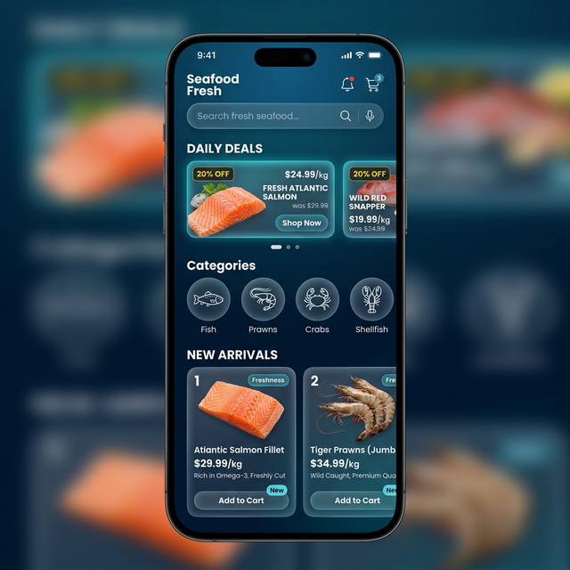
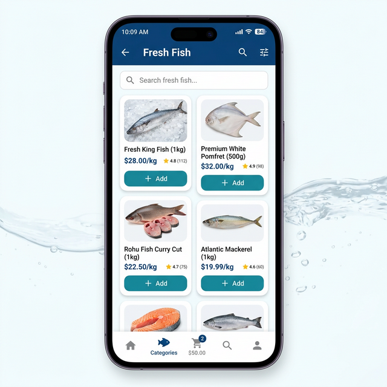
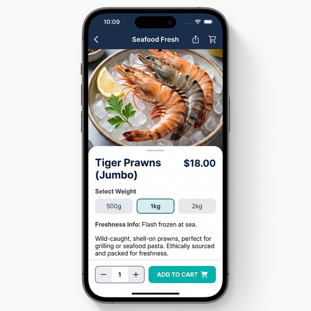

# 🐟 Seafood Store — Premium Mobile Frontend MVP

[](https://flutter.dev)
[](https://dart.dev)
[](https://opensource.org/licenses/MIT)

**Seafood Store** is a high-performance, conversion-focused mobile eCommerce application built with **Flutter**. It features a stunning ocean-glassmorphism design, sophisticated animations, and a production-ready shopping flow.

---

## 📱 Visual Preview

| Home Screen | Product Grid | Product Detail |
|:---:|:---:|:---:|
|  |  |  |

---

## 🚀 Key Features

- **🌊 Immersive UI**: Premium teal-themed transparency effect (Ocean Glassmorphism).
- **🚀 Conversion-Focused Onboarding**: Interactive introduction to brand value propositions.
- **⚖️ Dynamic Pricing Engine**: Real-time price calculation based on weight multipliers (500g, 1kg, 2kg).
- **🛒 Robust Cart Management**: Persistent cart state utilizing the Provider pattern and local storage.
- **💳 Optimized Checkout**: 3-step streamlined flow for Address -> Slot -> Payment.
- **🏁 Post-Order Experience**: Beautiful order success animations and order tracking timeline.
- **⚡ Performance First**: Micro-animations and staggered loading for a smooth 60fps experience.

---

## 🛠️ Technology Stack

- **Framework**: [Flutter](https://flutter.dev)
- **State Management**: [Provider](https://pub.dev/packages/provider)
- **UI & Aesthetics**: [Google Fonts (Poppins)](https://fonts.google.com/specimen/Poppins), [Animate Do](https://pub.dev/packages/animate_do)
- **Networking**: [Dio](https://pub.dev/packages/dio) (Integration ready)
- **Local Persistence**: [Shared Preferences](https://pub.dev/packages/shared_preferences)

---

## 📦 Getting Started

### Prerequisites

- Flutter SDK (>= 3.0.0)
- Android Studio / VS Code
- Dart 3.x

### Installation

1. **Clone the repository**
   ```bash
   git clone https://github.com/zeeshansarwar1986/Seafood-Store-App.git
   cd Seafood-Store-App
   ```

2. **Install dependencies**
   ```bash
   flutter pub get
   ```

3. **Run the application**
   ```bash
   flutter run
   ```

---

## ⚓ Future Roadmap

- [ ] Integration with real-time Firebase / Node.js backend.
- [ ] Push notifications for delivery updates.
- [ ] Multi-currency and multi-language support.
- [ ] Integration of Stripe/Razorpay payment gateways.

---

## 📝 Documentation

For more detailed information, please refer to the following:
- [📖 Project Description (Bilingual)](DOCS/PROJECT_DESCRIPTION.md)
- [🛠️ Tools & Editing Guide](DOCS/TOOLS_GUIDE.md)

---

**Author**: [Zeeshan Sarwar](https://github.com/zeeshansarwar1986)  
**License**: This project is licensed under the MIT License.
